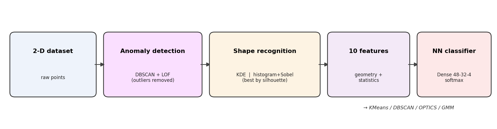
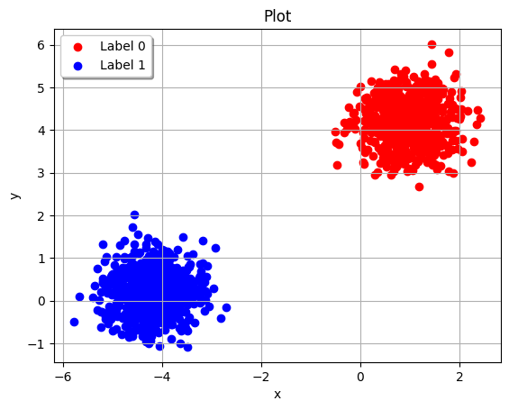
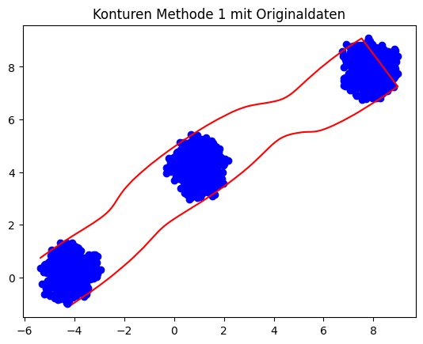
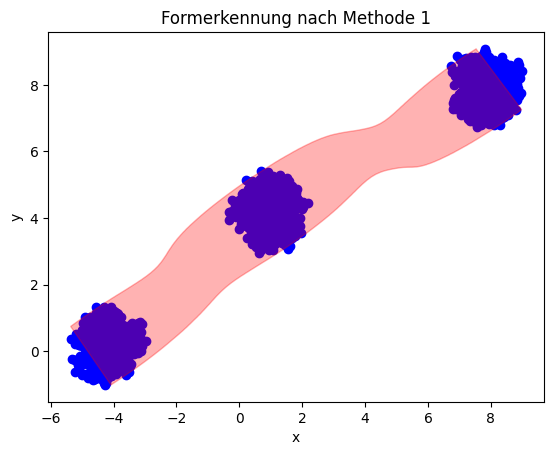
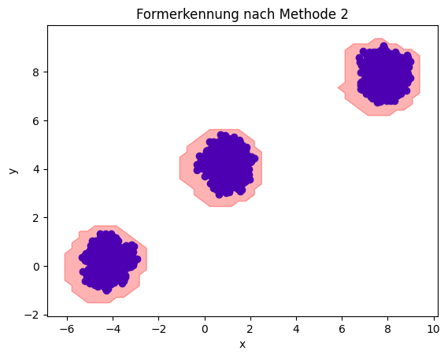
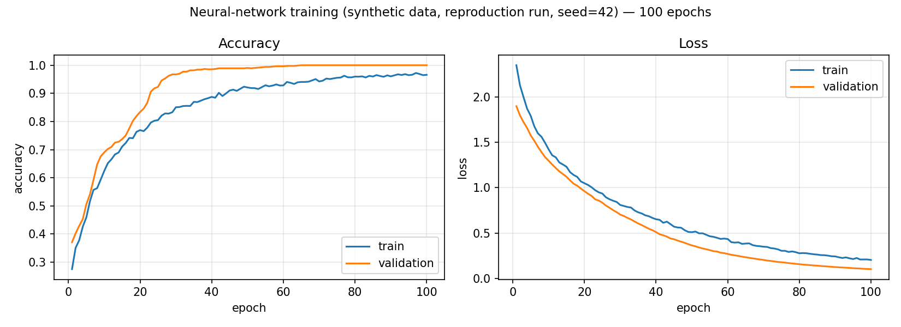
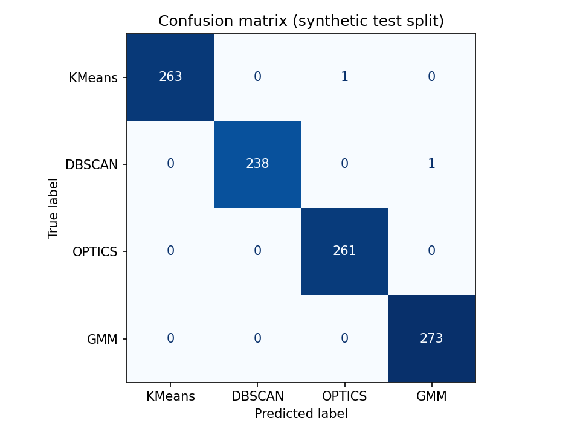

# Automated Multi-Object Clustering Using Machine Learning

### Learning to select clustering algorithms from geometric and statistical dataset descriptors

**Authors:** Hagen Jacob, Jan Edgar König, Robert Vetter
**Affiliation:** Spezialschulteil des Albert-Schweitzer-Gymnasiums Erfurt (specialised STEM track)
**External scientific guidance:** Dr. Wolfgang Felber and Christopher Sobel, Fraunhofer IIS, Nuremberg
**Type:** Secondary-school research project (*Seminarfacharbeit*, grades 11/12, 2022–2024)

> This is a student/seminar research report. It is **not** peer-reviewed and is
> not a journal or conference publication. It is an English write-up of the
> original German seminar paper ([`seminar-paper.pdf`](seminar-paper.pdf)), with
> results reproduced from the project's code and committed data. All reported
> metrics are on **synthetic** data unless stated otherwise.

---

## Abstract

Choosing an appropriate clustering algorithm for an unlabelled dataset is
normally a manual, expertise-dependent task: different algorithms suit different
geometries, and there is no universally best choice. This project investigates
whether the choice can be **automated** by describing a dataset with a small set
of geometric and statistical descriptors and learning a mapping from those
descriptors to the most suitable algorithm. We build a three-stage pipeline —
density-based outlier removal (DBSCAN + Local Outlier Factor), contour-based
shape characterisation (Gaussian kernel-density estimation and a histogram-edge
method, selected by silhouette score), and extraction of **ten** geometric/
statistical features — followed by a compact neural-network classifier
(≈2,500 parameters) that selects among four complementary algorithms: K-Means,
DBSCAN, OPTICS, and Gaussian Mixture Models. The classifier is trained on
**5,184 synthetic datasets**, balanced across the four classes. On a held-out
synthetic test split it reaches **99.81% accuracy** with near-uniform per-class
F1-scores (≈0.998). We report the methodology, experiments, and results in
detail, and are explicit about the central limitation: the evaluation is on
synthetic data, where each dataset's label follows from its generating family;
generalisation to arbitrary real-world data is markedly lower (the companion
article reports ≈70%) and is left to future work.

**Keywords:** clustering, algorithm selection, meta-features, neural networks,
outlier detection, unsupervised learning.

---

## 1. Introduction and motivation

Clustering partitions unlabelled data into groups of similar points and is a
core tool of unsupervised learning. In practice, however, the analyst must first
decide *which* clustering algorithm to use: K-Means assumes compact, roughly
spherical clusters; DBSCAN finds arbitrarily-shaped, density-connected clusters
and is robust to noise; OPTICS extends density-based clustering to varying
densities; and Gaussian Mixture Models (GMM) model soft, overlapping,
elliptical clusters. A poor choice produces misleading groupings.

Selecting the algorithm is itself a decision problem that is usually solved by
hand using domain expertise and trial-and-error. This project asks whether that
decision can be **learned**: given a dataset, can a model recommend the
best-suited clustering algorithm automatically? Concretely, we restrict the
choice to four complementary algorithms and learn a classifier from a compact,
fixed-length description of a dataset's geometry and statistics.

This is an instance of the **algorithm-selection problem** [Rice, 1976]: map a
problem instance, via measurable features, to the best-performing algorithm from
a portfolio. Our contribution is a concrete, end-to-end pipeline for the
clustering case, in which the dataset-description step is itself non-trivial and
combines density estimation, contour extraction, and classical shape statistics.

## 2. Background and related work

**The algorithm-selection problem.** Rice [1976] framed algorithm selection as
learning a mapping from a feature space describing problem instances to a
performance space over a portfolio of algorithms. Modern meta-learning and
AutoML follow this template, characterising datasets by *meta-features* and
learning which method works best. This project applies that idea to clustering,
with hand-designed geometric/statistical meta-features.

**Clustering algorithms.** The four algorithms in our portfolio are: K-Means
[Lloyd, 1982; MacQueen, 1967], DBSCAN [Ester et al., 1996], OPTICS
[Ankerst et al., 1999], and Gaussian Mixture Models fitted via
Expectation–Maximisation [Dempster et al., 1977]. They are complementary:
centroid-, density-, ordering-, and probability-based respectively.

**Outlier detection.** Outliers distort geometric descriptors, so they are
removed first. We combine DBSCAN's intrinsic noise labelling with the Local
Outlier Factor (LOF) [Breunig et al., 2000], a local density-deviation score.

**Cluster validity and density estimation.** Internal choices (DBSCAN
`min_samples`, the density threshold, the smoothing parameter) are made with the
silhouette coefficient [Rousseeuw, 1987]. Shape is captured from a kernel
density estimate [Rosenblatt, 1956; Parzen, 1962].

## 3. Problem formulation

Let a dataset be a finite point set $X = \{x_1, \dots, x_n\} \subset
\mathbb{R}^2$. Let $\mathcal{A} = \{\text{KMeans}, \text{DBSCAN},
\text{OPTICS}, \text{GMM}\}$ be the algorithm portfolio. We seek a function

$$ F : X \;\longmapsto\; a \in \mathcal{A} $$

that returns the algorithm best suited to $X$. We factor $F$ as

$$ F = c \circ \phi, \qquad \phi : X \to \mathbb{R}^{10}, \quad c : \mathbb{R}^{10} \to \mathcal{A}, $$

where $\phi$ maps a dataset to a fixed 10-dimensional feature vector
(Section 4.4) and $c$ is a neural-network classifier (Section 4.5). The map
$\phi$ is the core difficulty: it must summarise an arbitrary-size point cloud
into a small, informative, fixed-length descriptor.

## 4. Methodology

The full pipeline is shown in Figure 1: outlier removal → shape recognition →
feature extraction → classification.

**Figure 1.** *The four-stage pipeline.*



### 4.1 Synthetic dataset generation

Training data is generated synthetically with scikit-learn's dataset
generators. Four generators are used, each associated with the clustering
algorithm best suited to its structure **by construction**:

| Generator (`sklearn.datasets`) | Structure | Assigned label |
|---|---|---|
| `make_blobs` | compact, round clusters | KMeans |
| `make_circles` | concentric rings | OPTICS |
| `make_moons` | interleaving crescents | DBSCAN |
| `make_gaussian_quantiles` | nested Gaussian shells | GMM |

Datasets are produced over grids of parameters (sample counts in
$\{500, 800, 1000, 1200, 1500, 1700, 2000, 2500, 4000\}$; cluster counts
$\{3,4,5,6\}$; noise levels $\{0.02, 0.04, 0.06\}$; circle factors
$\{0.3, 0.5\}$; quantile classes $\{1,2,3\}$). Each base dataset is additionally
**augmented** (Section 4.1.1) to increase variety and robustness. The procedure
yields **5,184 datasets**, exactly **balanced** at **1,296 per class**.

For each dataset the 10-feature vector (Section 4.4) is computed; the resulting
table is scaled **column-wise** with a `RobustScaler` (median/IQR, robust to
outliers) and stored as the training table `data/data_scaled.xlsx`.

> **Note on labels.** The label is the algorithm assumed best for the generating
> family, not the empirical winner of running all four algorithms on each
> dataset. This is a deliberate simplification and a key limitation (Section 8).

#### 4.1.1 Data augmentation

Each base point cloud is transformed by a randomised, label-preserving sequence
(class `DataAugmentor`): removing a random subset of points; adding jittered
copies of existing points ($+\,0.05\,\mathcal{N}(0,I)$); isotropic scaling by a
factor in $[0.5, 1.5)$; small uniform shifts; and a random rotation about the
centroid by $\theta \sim \mathcal{U}[0, 2\pi)$.

### 4.2 Anomaly detection (Stage 1)

Outliers are removed so they do not distort the shape descriptors. Two
detectors are combined and their flagged points unioned.

**DBSCAN with an automatic radius.** For a candidate `min_samples` $= k$, the
radius is set by the k-distance heuristic: let $d_k(x)$ be the distance from $x$
to its $k$-th nearest neighbour; then

$$ \varepsilon = Q_{0.93}\big(\{\,d_k(x) : x \in X\,\}\big), $$

the 93rd percentile, which admits at most ~7% of points as low-density (noise).
`min_samples` is swept over $[2d, 3d)$ for data dimension $d$ (here $d=2$), and
the value maximising the silhouette score of the resulting non-noise clusters is
kept.

**Local Outlier Factor.** LOF [Breunig et al., 2000] scores each point by how
isolated it is relative to its neighbours. Its hyperparameters (`n_neighbors`
$\in [10, 25)$, `contamination` $\in \{0.01, 0.02, 0.03\}$) are grid-searched
against the known synthetic inlier/outlier labels using the **macro F1-score**,
appropriate for the strong class imbalance between inliers and outliers.

The final outlier set is the union of the DBSCAN-noise points and the
LOF-flagged points; these are removed before Stage 2.

### 4.3 Shape / contour recognition (Stage 2)

The geometry of the cleaned cloud is captured by the contours enclosing its
dense regions. Two independent methods are computed and the better one is kept by
silhouette score.

**Method 1 — density contours.** A 2-D Gaussian kernel-density estimate
[Parzen, 1962] is evaluated on a $100 \times 100$ grid,

$$ \hat f(z) = \frac{1}{n}\sum_{i=1}^{n} K_H\!\left(z - x_i\right), $$

and contour lines are drawn at the level $\lambda = \text{factor} \cdot
\overline{\hat f}$ for several factors $\in \{0.7, 1.0, 1.5, 3.0\}$; the factor
maximising the silhouette score (Section 4.3.1) is chosen.

**Method 2 — histogram edges.** A padded $64 \times 64$ 2-D histogram of the
points is convolved with a Sobel operator to obtain an edge-magnitude field
$\lVert\nabla h\rVert$, smoothed by a Gaussian filter of width $\sigma$,
thresholded, and run through `skimage.measure.find_contours`. The contours are
rescaled to data coordinates. The smoothing $\sigma \in \{0.7, 1, 1.5, 3\}$ that
maximises the silhouette score is chosen.

**Method selection.** The method whose contours give the higher silhouette score
is used downstream (Figures 2–3).

#### 4.3.1 Contour scoring

To score a candidate set of contours, each contour is treated as a polygon and
every point is assigned the index of the polygon that contains it (or marked as
noise if contained by none). The silhouette coefficient [Rousseeuw, 1987] of
that labelling,

$$ s(i) = \frac{b(i) - a(i)}{\max\{a(i), b(i)\}}, $$

(with $a(i)$ the mean intra-cluster distance and $b(i)$ the mean nearest-cluster
distance), is averaged over points and used as the contour-quality score.

**Figure 2.** *An example synthetic dataset (left) and the extracted contours
overlaid on it (right).*

| | |
|---|---|
|  |  |

**Figure 3.** *Filled shape recognition: density method (left) vs. histogram
method (right). The better-scoring method is selected per dataset.*

| | |
|---|---|
|  |  |

### 4.4 The ten features (Stage 3)

The cleaned cloud and its selected contours are reduced to a fixed
10-dimensional vector. The contours give shape descriptors; the points give
distributional descriptors.

| # | Feature | Definition |
|---|---------|------------|
| 1 | mean eccentricity | mean over contours of $e=\sqrt{1-(b/a)^2}$, the eccentricity of the best-fit ellipse (axes $a\ge b$) via `cv2.fitEllipse` |
| 2 | std eccentricity | standard deviation of the per-contour eccentricities |
| 3 | contour/convex-hull area ratio | mean over contours of (contour area)/(convex-hull area); $\to 1$ for convex shapes |
| 4 | variance of centroid distances | $\operatorname{Var}\big(\lVert x_i - \bar{x}\rVert\big)$ over points |
| 5 | contour-area/points ratio | mean over contours of (polygon area)/(number of enclosed points) |
| 6 | mean kurtosis | mean of the per-axis kurtosis of the coordinates |
| 7 | std kurtosis | standard deviation of the per-axis kurtosis |
| 8 | mean skewness | mean of the per-axis skewness of the coordinates |
| 9 | std skewness | standard deviation of the per-axis skewness |
| 10 | compactness | $\frac{1}{n}\sum_i \lVert x_i - \bar{x}\rVert^2$, mean squared distance to the centroid |

### 4.5 Neural-network classifier (Stage 4)

The classifier $c$ is a compact Keras `Sequential` network:

```
Input(10)
Dense(48, ReLU, L2=0.01) → Dropout(0.5) → BatchNorm
Dense(32, ReLU, L2=0.01) → Dropout(0.5) → BatchNorm
Dense(4, softmax)
```

Class probabilities use the softmax $\sigma(z)_j = e^{z_j}/\sum_k e^{z_k}$, and
training minimises the (sparse) categorical cross-entropy
$\mathcal{L} = -\sum_j y_j \log \hat y_j$. Optimisation uses Adam with learning
rate $10^{-4}$, batch size 32, for 100 epochs. The model has **2,548 parameters**
(2,388 trainable), of which the dropout (0.5), L2 weight decay, and batch
normalisation provide regularisation against overfitting on the small feature
table.

## 5. Experimental setup

| Item | Value |
|---|---|
| Dataset | 5,184 synthetic datasets → 10 features each, `RobustScaler`-scaled |
| Class balance | 1,296 each: KMeans / DBSCAN / OPTICS / GMM |
| Split | 80% train / 20% test, `train_test_split(random_state=42)` |
| Validation | 20% of the training set (`validation_split=0.2`) |
| Resulting sizes | 4,147 train (incl. validation) / 1,037 test |
| Optimiser | Adam, lr $10^{-4}$, batch size 32, 100 epochs |
| Seed | 42 (`tf.keras.utils.set_random_seed`) for the run reported here |
| Environment | Python 3.11, TensorFlow 2.x, scikit-learn (see Appendix A) |

The results below come from a single reproducible run (seed 42) using the
committed data and the architecture above. For reference, the original project
notebook independently logged ≈99.90% test accuracy on its (unseeded) run.

## 6. Results

On the held-out synthetic test split, the classifier reaches **99.81% accuracy**.
Training and validation curves are shown in Figure 4; the confusion matrix in
Figure 5; per-class metrics in Table 1.

**Figure 4.** *Training/validation accuracy and loss over 100 epochs
(reproduction run, seed 42; synthetic data).*



**Figure 5.** *Confusion matrix on the synthetic test split (1,037 datasets).
Two misclassifications in total.*



**Table 1.** *Per-class precision, recall, and F1 on the synthetic test split.*

| Class | Precision | Recall | F1 | Support |
|---|---|---|---|---|
| KMeans | 1.0000 | 0.9962 | 0.9981 | 264 |
| DBSCAN | 1.0000 | 0.9958 | 0.9979 | 239 |
| OPTICS | 0.9962 | 1.0000 | 0.9981 | 261 |
| GMM | 0.9964 | 1.0000 | 0.9982 | 273 |
| **Macro avg** | **0.9981** | **0.9980** | **0.9981** | 1,037 |
| **Weighted avg** | **0.9981** | **0.9981** | **0.9981** | 1,037 |

Performance is high and near-uniform across classes; the only errors are one
KMeans dataset predicted as OPTICS and one DBSCAN dataset predicted as GMM.

## 7. Discussion

The results show that the 10 hand-designed descriptors carry enough information
to separate the four generating families almost perfectly with a small network.
In other words, **the feature map $\phi$ — not the classifier — is where the work
is**: once datasets are summarised by these shape and distribution statistics,
the four synthetic families become nearly linearly separable, and a
2,500-parameter network suffices. This validates the overall design (describe,
then classify) and the choice of descriptors.

It is important to read the 99.81% correctly: it measures how well the model
recovers the **generating family** of a synthetic dataset from its descriptors,
under the assumption that the family determines the best algorithm. It is not a
measurement of clustering quality on real data.

## 8. Limitations

We are explicit about the boundaries of the result:

1. **Synthetic validation.** All quantitative results are on synthetic data. The
   companion write-up reports roughly **70%** on real-world datasets, and the
   original paper states the method was tested mainly on synthetic and only a few
   real datasets. The synthetic-to-real gap is the principal limitation.
2. **Label assumption.** Each dataset's "best algorithm" label is its generating
   family, not the empirical winner of running and scoring all four algorithms.
   This makes the task partly a family-recognition task.
3. **Scope.** The method is restricted to **2-D** data and a **four-algorithm**
   portfolio.
4. **Pipeline cost.** Feature extraction runs density estimation, contour
   searches, and several parameter sweeps per dataset, which is computationally
   heavy at scale.

A candid statement of these limits is part of representing the work honestly: the
project is a strong, complete research effort at the secondary-school level, not
a production or peer-reviewed system.

## 9. Conclusion and future work

We presented an end-to-end, learned approach to clustering-algorithm selection:
a robust descriptor pipeline (outlier removal, contour-based shape recognition,
ten geometric/statistical features) feeding a compact neural classifier, trained
on 5,184 balanced synthetic datasets and reaching 99.81% on a held-out synthetic
split. Promising directions include: labelling datasets by **empirically**
running and scoring all candidate algorithms rather than by generating family;
**real-world** evaluation and the synthetic-to-real gap; extending beyond 2-D and
to more algorithms; and applying the selector to a concrete downstream task.

## Contributions

This was a collaborative team project by Hagen Jacob, Jan Edgar König, and
Robert Vetter, developed jointly (largely on a shared notebook, with little
formal division of labour, as noted in the original paper). Robert Vetter
contributed to the design and implementation of the pipeline and authored the
public technical write-up of the project. The external advisors provided
scientific guidance but were not authors of the system.

## Acknowledgments

We thank our school supervisors **Dr. Marion Moor** and **Johannes Süpke**, and
our external scientific advisors **Dr. Wolfgang Felber** and **Christopher Sobel**
of **Fraunhofer IIS (Nuremberg)**, who gave regular feedback over the course of
the project and hosted a practicum. Fraunhofer's involvement was **advisory
only**; the institute did not fund, adopt, or deploy the system.

## References

1. J. R. Rice. *The Algorithm Selection Problem.* Advances in Computers, 15:65–118, 1976.
2. S. P. Lloyd. *Least Squares Quantization in PCM.* IEEE Transactions on Information Theory, 28(2):129–137, 1982.
3. J. MacQueen. *Some Methods for Classification and Analysis of Multivariate Observations.* Proc. 5th Berkeley Symposium on Mathematical Statistics and Probability, 1:281–297, 1967.
4. M. Ester, H.-P. Kriegel, J. Sander, X. Xu. *A Density-Based Algorithm for Discovering Clusters in Large Spatial Databases with Noise.* Proc. KDD, 226–231, 1996.
5. M. Ankerst, M. M. Breunig, H.-P. Kriegel, J. Sander. *OPTICS: Ordering Points To Identify the Clustering Structure.* Proc. ACM SIGMOD, 49–60, 1999.
6. A. P. Dempster, N. M. Laird, D. B. Rubin. *Maximum Likelihood from Incomplete Data via the EM Algorithm.* Journal of the Royal Statistical Society, Series B, 39(1):1–38, 1977.
7. M. M. Breunig, H.-P. Kriegel, R. T. Ng, J. Sander. *LOF: Identifying Density-Based Local Outliers.* Proc. ACM SIGMOD, 93–104, 2000.
8. P. J. Rousseeuw. *Silhouettes: A Graphical Aid to the Interpretation and Validation of Cluster Analysis.* Journal of Computational and Applied Mathematics, 20:53–65, 1987.
9. E. Parzen. *On Estimation of a Probability Density Function and Mode.* Annals of Mathematical Statistics, 33(3):1065–1076, 1962.
10. M. Rosenblatt. *Remarks on Some Nonparametric Estimates of a Density Function.* Annals of Mathematical Statistics, 27(3):832–837, 1956.
11. F. Pedregosa et al. *Scikit-learn: Machine Learning in Python.* Journal of Machine Learning Research, 12:2825–2830, 2011.
12. M. Abadi et al. *TensorFlow: A System for Large-Scale Machine Learning.* Proc. USENIX OSDI, 265–283, 2016.

## Appendix A — Reproducibility

```bash
pip install -r requirements.txt
python -m src.data_generation   # (optional) regenerate data/data_scaled.xlsx — heavy
python -m src.train             # train (seed 42) -> models/classifier.keras
python -m src.evaluate          # accuracy + per-class report + confusion matrix
```

- **Data:** `data/data_scaled.xlsx` (committed) — the feature table used here.
- **Split:** `train_test_split(test_size=0.2, random_state=42)`; `validation_split=0.2`.
- **Seed:** `tf.keras.utils.set_random_seed(42)` for the reported run.
- **Original notebook:** `notebooks/clustering-algorithm-selection.ipynb` (preserved).
- Regeneration of the dataset uses random states and is computationally heavy, so
  the regenerated file will not match byte-for-byte; the committed file is the
  artifact used for the results above.

## Appendix B — Feature definitions

See Section 4.4 (Table) for the precise definition of each of the ten features
and [`../data/DATA.md`](../data/DATA.md) for the data schema and class encoding.
